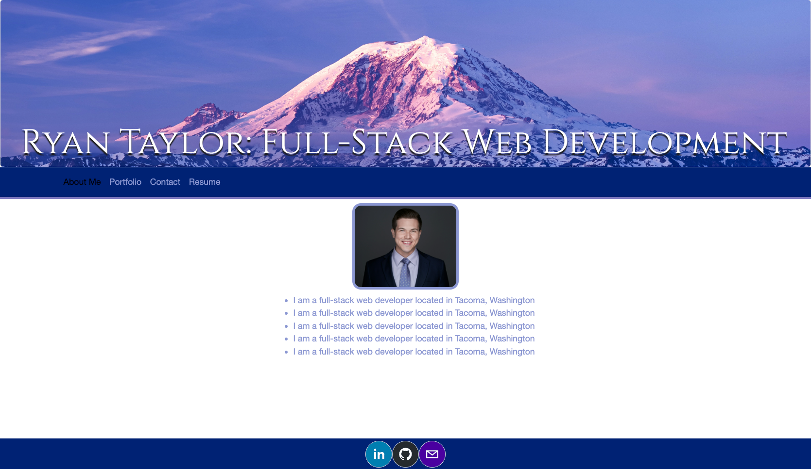

# Ryan Taylor Portfolio

## Description
My professional portfolio to show to potential employers. Contains about me, portfolio, contact, and resume sections. About me contains a head-shot and bio. Portfolio contains some of my recent projects with links to the deployed site and GitHub repo. Contact section allows users to input their name and email to send me a message. Resume section lists proficiencies as well as a link to download my resume. The bottom of the page includes icons with links to my LinkedIn, GitHub, and email. 

## Screenshot

## Link To Deployed Application
[Deployed Application](https://ryan-m-taylor.github.io/rt-portfolio/)